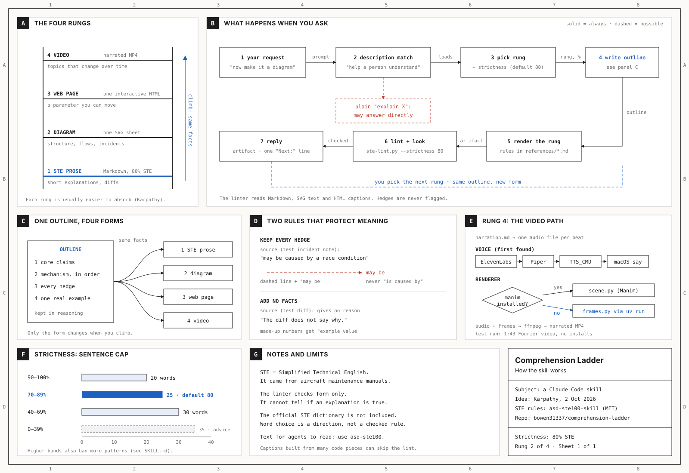

# comprehension-ladder

**A Claude Code skill that explains anything so a human can understand it: as Simplified Technical English prose, a blueprint diagram, an interactive HTML page, or a narrated 3Blue1Brown-style video.**

LLMs now do most of the legwork. The human job moves up to oversight and understanding. This skill does the understanding part well. It turns a concept, a diff, a design doc, an incident note or an LLM's wall of text into the format that is easiest to absorb, and it never adds facts or drops hedges along the way.

The idea comes from [Andrej Karpathy's post of 2 October 2026](https://x.com/karpathy/status/2105819303471976479). It describes a ladder of output formats, where each rung is usually easier to absorb than the one below it.

## The ladder

| Rung | Output | Good for |
|---|---|---|
| **1. STE prose** | Markdown in [ASD-STE100](https://www.asd-ste100.org/) Simplified Technical English, with a strictness setting (default *"80% of the way to STE100"*) | Short explanations, diffs, answers you will re-read |
| **2. Diagram** | One self-contained SVG in a blueprint "overview sheet" style: lettered panels, title block, grid reference | Structure, data flow, sequences, incidents |
| **3. Web page** | One offline-capable interactive HTML file that runs the real computation | Anything with a parameter, a process over time, or a "what if" |
| **4. Explainer video** | Narrated MP4: STE narration + TTS + animation, rendered with Manim or the bundled `frames.py` renderer | Topics with a story that changes over time |

Each reply ends with one line that offers the next rung up, e.g. `Next: diagram (2) · HTML (3) · video (4)`.

## What makes it different from "just ask the model"

- **Same facts on every rung.** The skill writes an internal outline first (claims, mechanism, hedges, one example). Every format renders that outline, so climbing the ladder changes the form, never the facts.
- **Hedges survive.** "May be caused by a race condition" stays a hedge: a dashed arrow in a diagram, a caption on a page, a spoken "may" in a video.
- **No invented facts.** If a diff does not say *why*, the explanation says "the diff does not say why". Sample values are labelled as examples.
- **A real linter.** `scripts/ste-lint.py` checks the structural STE rules at the chosen strictness. It reads Markdown, the visible text of HTML/SVG, and runtime captions in `<script>` blocks. It never flags hedges, because confidence is content.
- **A video with no heavy installs.** If Manim is missing, `frames.py` renders 3b1b-style frames with numpy + Pillow through `uv run` (packages go to uv's isolated cache, not the system), and ffmpeg combines them with the narration.

## Install

**Symlink (recommended for local development):**
```bash
git clone https://github.com/bowen31337/comprehension-ladder.git
ln -s "$PWD/comprehension-ladder" ~/.claude/skills/comprehension-ladder
```

**skills CLI:**
```bash
npx skills add bowen31337/comprehension-ladder
```

Claude Code picks the skill up on the next session. Check with `/skills`.

## Usage

Just ask. For example:

```text
Explain how a transformer's attention works, 80% of the way to ASD-STE100.
Explain this git diff to me: ./retry.diff
Diagram how the OAuth2 authorization-code flow works.
Make an interactive HTML explainer of gradient descent.
Create a 3b1b style video explainer on the Fourier transform.
Read incident-note.md and make me a diagram of what happened.
```

### Strictness setting

| Setting | Enforces |
|---|---|
| 90–100 | All structural rules, ≤20-word sentences, one word per meaning, active voice |
| 70–89 *(default 80)* | Structural rules, ≤25-word sentences, no semicolons, phrasal verbs, nominalizations or marketing adjectives |
| 40–69 | ≤30-word sentences, no semicolons or marketing adjectives |
| <40 | Advice only |

### Example: the skill explaining itself

**Live page: https://bowen31337.github.io/comprehension-ladder/**

[`examples/how-it-works/`](examples/how-it-works/) holds the skill's own output when it was asked to explain how it works. It climbed all four rungs from one outline:

| Rung | File |
|---|---|
| 1. STE prose (80%) | [`explanation.md`](examples/how-it-works/explanation.md) |
| 2. Diagram | [`how-it-works.svg`](examples/how-it-works/how-it-works.svg) |
| 3. Web page | [`how-it-works.html`](examples/how-it-works/how-it-works.html), served live on [GitHub Pages](https://bowen31337.github.io/comprehension-ladder/): a request router, a live strictness linter, the ladder, and the video-path switches |
| 4. Video | [`video/`](examples/how-it-works/video/): an 89-second narrated MP4 (14 beats), with its `narration.md` and `scene_frames.py`. Rendered with `frames.py` and macOS `say`, no installs |

A GitHub Actions workflow ([`.github/workflows/pages.yml`](.github/workflows/pages.yml)) republishes the page on every push that touches the example.



## Requirements

- **Rungs 1–3:** [uv](https://docs.astral.sh/uv/) to run the linter (`uv run scripts/ste-lint.py --selftest`).
- **Rung 4:** `uv`, `ffmpeg`, and a voice. The voice is the first available of `ELEVENLABS_API_KEY`, Piper (`PIPER_MODEL`), any CLI set in `TTS_CMD` (e.g. Kokoro), or macOS `say`. Manim (`uv tool install manim`) is optional and gives smoother animation. `scripts/render_video.sh` detects what is present, prints install commands for what is missing, and installs nothing system-wide.

## Repository layout

```
SKILL.md                        # the skill: ladder, strictness, process, output rules
references/
  ste-rules.md                  # STE writing rules (paraphrased, no ASD dictionary)
  strictness-dial.md            # rule bands + one paragraph rendered at 100 / 80 / 50
  diagram-style.md              # blueprint overview-sheet conventions + SVG skeleton
  html-explainer.md             # interactions that aid understanding (and ones that don't)
  video-pipeline.md             # narration beats, Manim / frames.py scenes, TTS, ffmpeg
scripts/
  ste-lint.py                   # structural STE linter (--strictness, HTML/SVG/JS text)
  frames.py                     # numpy + Pillow 3b1b-style renderer (no Manim needed)
  render_video.sh               # TTS → Manim or frames.py → ffmpeg
assets/
  html-explainer-template.html  # rung-3 starting point (light/dark, mobile-ready)
examples/
  how-it-works/                 # the skill explaining itself: all four rungs (live on Pages)
evals/
  evals.json                    # test prompts used to benchmark the skill
  files/                        # eval fixtures (a retry diff, an incident note)
```

## Evaluation

The skill was built and iterated with Anthropic's `skill-creator`, using six test prompts (one per rung, plus a diff and a hedge-trap incident note), each run with and without the skill:

- **Assertion pass rate:** 98% with the skill vs 62% without. Part of the gap is format checks that only the skill targets. The fair quality checks (lint at 80%, hedge preservation, video actually delivered) all pass with the skill.
- **Triggering:** the description was tuned on 20 realistic prompts, including near-misses such as agent-facing STE rewrites. Precision is 100% (no false triggers). Recall on plain "explain X" requests is moderate, because Claude often answers those directly. Naming the format ("in STE", "diagram", "HTML explainer", "video") triggers the skill reliably.

## Scope and limits

- Not for rewriting agent-facing strings (tool descriptions, error messages, prompts) so an agent cannot misread them. Use [asd-ste100-skill](https://github.com/danyuchn/asd-ste100-skill) for that.
- Not certified ASD-STE100 compliance. The skill does not reproduce ASD's approved-word dictionary, which ASD permits only with written authority. Lexical rules are a direction of travel, not a checked standard.
- Clear form does not fix weak content. If the source does not explain something, the skill says so.

## Credits

- **Idea and ladder:** [Andrej Karpathy](https://x.com/karpathy/status/2105819303471976479).
- **STE rules, hedge-protection rule and the original linter:** [asd-ste100-skill](https://github.com/danyuchn/asd-ste100-skill) by Dustin Yuchen Teng (MIT). See [`LICENSE-asd-ste100-skill`](LICENSE-asd-ste100-skill). This project adds strictness bands and HTML/SVG/JS text extraction to the linter.
- **ASD-STE100** is a standard of ASD (AeroSpace and Defense Industries Association of Europe).

## License

[MIT](LICENSE). Vendored parts keep their original MIT license and copyright notice.
